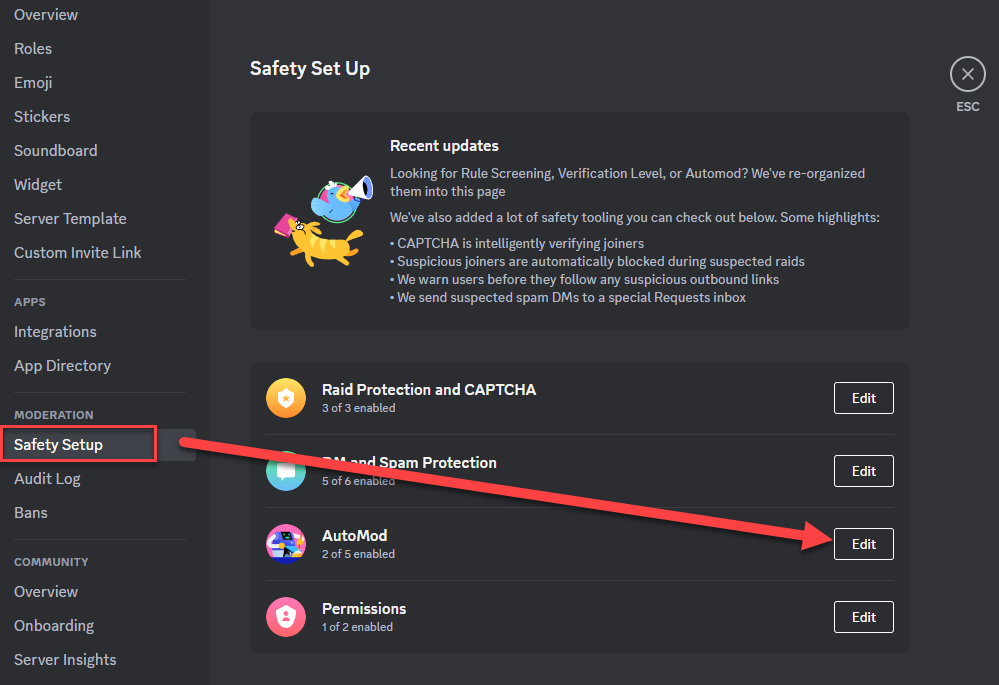
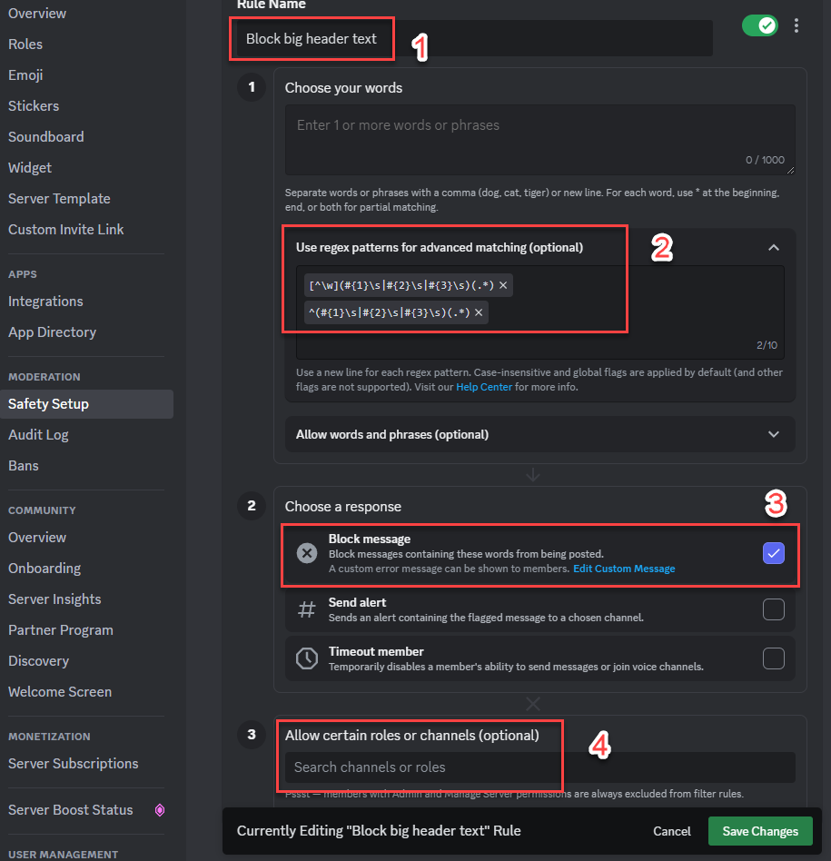

# Explanation of this regex pattern

Discord uses [a subset of the Rust regex engine](https://support.discord.com/hc/en-us/articles/10069840290711). Additionally, they remove line-breaks pre-processing, so at the time of this writing, \n never seems to match anything.

There are currently 2 regex patterns:

## Match markdown at the start of a line

```
^(#{1}\s|#{2}\s|#{3}\s)(.*)
```

This will match the following text:

```
# test
```

```
## test
```

```
### test
```

## Match markdown on other lines

```
[^\w](#{1}\s|#{2}\s|#{3}\s)(.*)
```

This will match the following text:

```
test
# test
```

```
test
## test
```

```
test
### test
```

Unfortunately, this pattern will also match the following:

```
test # test
```

```
test ## test
```

```
test ### test
```

Thankfully, this pattern will __NOT__ match the following (regardless of the number of # symbols):

```
test# test
```

```
test #test
```

```
test#test
```

# How to set this up

Open your Discord server's settings and go to AutoMod.



Once there, add an AutoMod rule for blocking markdown, then enter each regex pattern on its own line.

